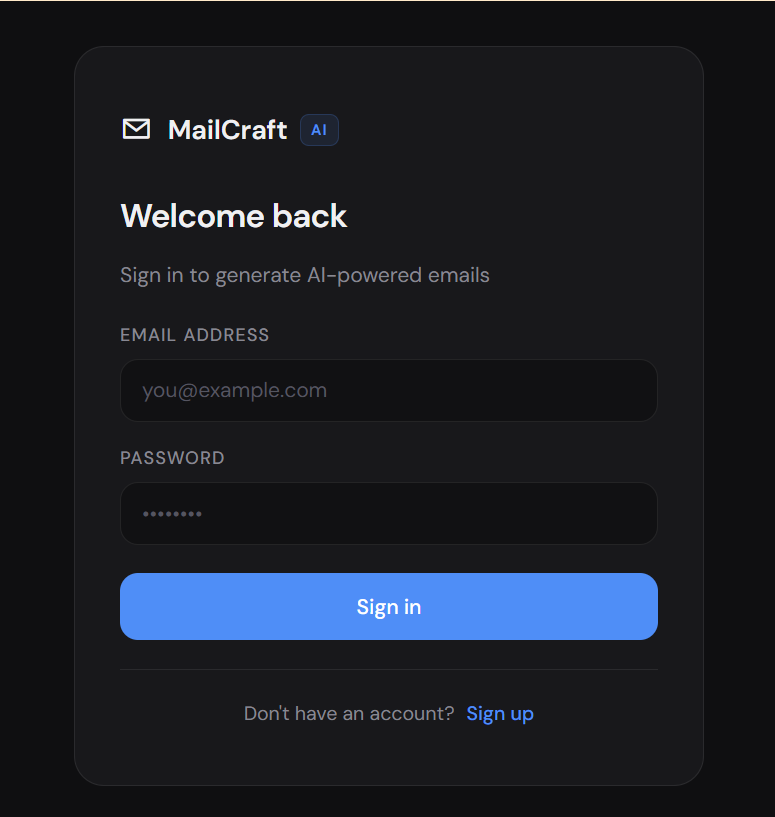
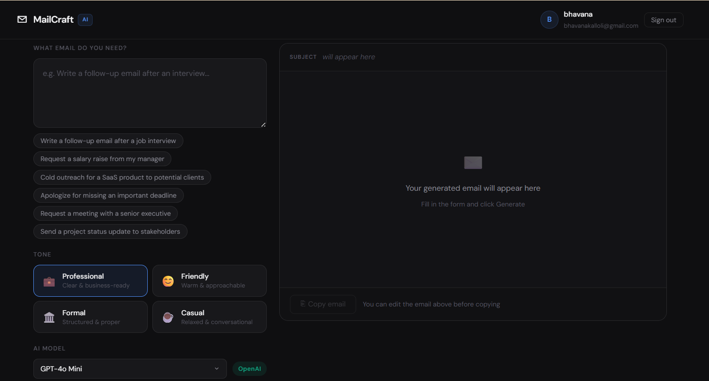
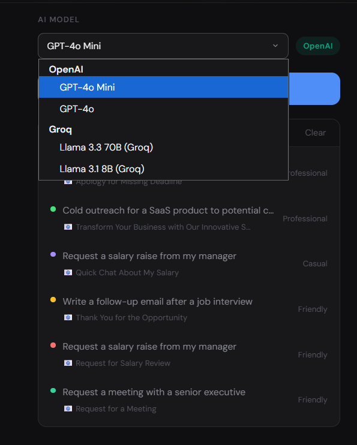
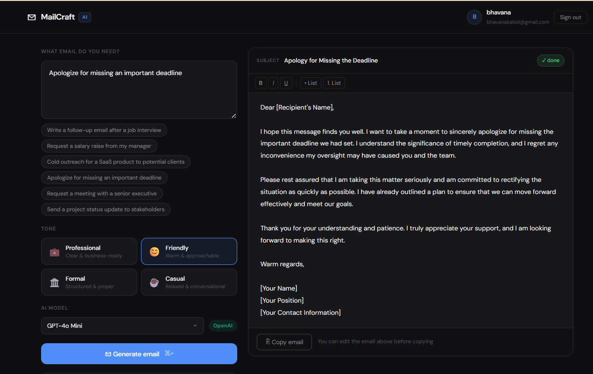

# MailCraft AI — AI Email Generator

A full-stack AI-powered email generation app built with **React + FastAPI + OpenAI + Groq**.

🚀 **Live Demo:** [https://ai-email-generator-ten.vercel.app](https://ai-email-generator-ten.vercel.app)

🔗 **API:** [https://ai-email-generator-1-arf1.onrender.com](https://ai-email-generator-1-arf1.onrender.com)

Users register/login, enter a prompt, select a tone, and instantly get a professional email with subject line — streamed word by word in real time.

---
## Screenshots

### Login Page


### Main App


### AI Model Selector


### Generated Email



---

## Features

### Mandatory
- ✅ AI-generated email content (subject + body) via OpenAI
- ✅ Tone selector — Professional, Friendly, Formal, Casual
- ✅ Responsive UI (mobile + desktop)
- ✅ FastAPI backend with proper REST API
- ✅ Loading state with streaming indicator
- ✅ Full error handling (auth errors, rate limits, API errors)
- ✅ Clean project structure
- ✅ README with setup instructions

### Bonus
- ✅ Streaming response (email types out word by word via SSE)
- ✅ Rich text editor (Bold, Italic, Underline, Lists — fully editable)
- ✅ Copy to clipboard (subject + body)
- ✅ Email subject line generation
- ✅ Prompt history (stored per user in SQLite, clickable to restore)
- ✅ Multiple AI model support (GPT-4o Mini, GPT-4o, Llama 3.3 70B, Llama 3.1 8B)
- ✅ JWT Authentication (Register / Login / Logout)
- ✅ SQLite database (users + email history persist across restarts)

---

## Tech Stack

| Layer    | Technology                        |
|----------|-----------------------------------|
| Frontend | React 18, Vite, CSS Modules       |
| Backend  | FastAPI, Python 3.11+, Uvicorn    |
| AI       | OpenAI API, Groq API              |
| Auth     | JWT (python-jose), passlib        |
| Database | SQLite (built-in Python)          |
| Streaming| SSE (Server-Sent Events)          |

---

## Project Structure

```
ai-email-generator/
├── backend/
│   ├── main.py          # FastAPI app — all routes
│   ├── auth.py          # JWT auth helpers
│   ├── database.py      # SQLite setup
│   ├── requirements.txt
│   └── .env.example
│
├── frontend/
│   ├── src/
│   │   ├── components/
│   │   │   ├── Header.jsx
│   │   │   ├── AuthPage.jsx
│   │   │   ├── ToneSelector.jsx
│   │   │   ├── EmailOutput.jsx
│   │   │   └── PromptHistory.jsx
│   │   ├── hooks/
│   │   │   └── useEmailGenerator.js
│   │   ├── utils/
│   │   │   └── api.js
│   │   ├── App.jsx
│   │   └── main.jsx
│   ├── index.html
│   ├── vite.config.js
│   └── package.json
│
└── README.md
```

---

## Setup Instructions

### Prerequisites
- Python 3.11+
- Node.js 18+
- OpenAI API key → [platform.openai.com](https://platform.openai.com/api-keys)
- Groq API key → [console.groq.com](https://console.groq.com) (free)

---

### 1. Clone the repository

```bash
git clone https://github.com/bhavanakalloli/ai-email-generator.git
cd ai-email-generator
```

---

### 2. Backend setup

```bash
cd backend

# Create virtual environment
python -m venv venv

# Activate it
# Mac/Linux:
source venv/bin/activate
# Windows:
venv\Scripts\activate

# Install dependencies
pip install -r requirements.txt

# Create .env file
cp .env.example .env
```

Edit `backend/.env` and add your keys:
```
OPENAI_API_KEY=sk-your-openai-key-here
GROQ_API_KEY=your-groq-key-here
SECRET_KEY=any-random-string-here
```

Start the backend:
```bash
uvicorn main:app --reload --port 8000
```

✅ Backend running at **http://localhost:8000**  
✅ API docs at **http://localhost:8000/docs**

---

### 3. Frontend setup

Open a new terminal:

```bash
cd frontend
npm install
npm run dev
```

✅ App running at **http://localhost:5173**

---

## API Reference

| Method | Endpoint | Description |
|--------|----------|-------------|
| POST | `/api/auth/register` | Register new user |
| POST | `/api/auth/login` | Login and get JWT token |
| GET | `/api/auth/me` | Get current user |
| POST | `/api/generate` | Generate email (non-streaming) |
| POST | `/api/generate/stream` | Generate email (streaming SSE) |
| GET | `/api/history` | Get user's email history |
| DELETE | `/api/history` | Clear user's history |
| GET | `/api/models` | Get available AI models |

---

## Environment Variables

### Backend (`backend/.env`)
| Variable | Required | Description |
|----------|----------|-------------|
| `OPENAI_API_KEY` | ✅ | OpenAI API key |
| `GROQ_API_KEY` | ✅ | Groq API key (free) |
| `SECRET_KEY` | ✅ | JWT signing secret |

---

## Author

Built for Rokkun Systems Private Limited — Full Stack AI Developer Assignment.
